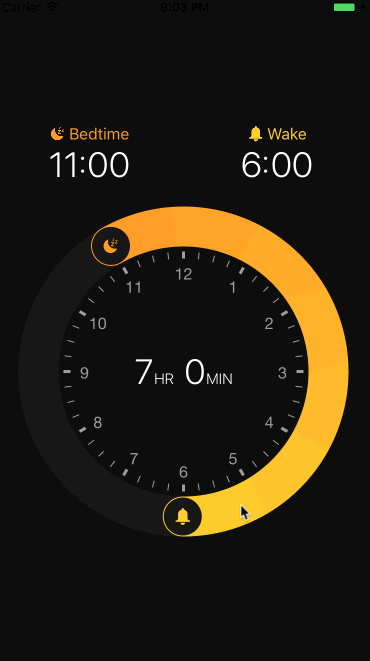

[]()
[](https://www.npmjs.com/package/react-native-circular-slider)
[](https://twitter.com/bgryszko)

# react-native-circular-slider :radio_button:

React Native component for creating circular slider.

## Example app – inspired by Apple's Bedtime :alarm_clock:
(It's just an example what you can achieve – with this package you can create any circular slider)



## Installation

1. Install library and react-native-svg

	```
	npm i --save react-native-circular-slider react-native-svg
	```
2. Link native code for SVG

	```
	react-native link react-native-svg
	```

## Usage

Import Circular Slider

```js
import CircularSlider from 'react-native-circular-slider';
```

Use as follows:

```jsx
<CircularSlider
  startAngle={this.state.startAngle}
  angleLength={this.state.angleLength}
  onUpdate={({ startAngle, angleLength }) => this.setState({ startAngle, angleLength })}
  segments={5}
  strokeWidth={40}
  radius={145}
  gradientColorFrom="#ff9800"
  gradientColorTo="#ffcf00"
  showClockFace
  clockFaceColor="#9d9d9d"
  bgCircleColor="#171717"
  stopIcon={<G><Path .../></G>}
  startIcon={<G><Path .../></G>}
/>
```


## Configuration

You can configure the passing by following props:

- **startAngle** – angle where the slider starts (from 0 to 2π)
- **angleLength** - length of the slider (from 0 to 2π)
- **onUpdate({ startAngle, angleLength })** - when slider is moved, onUpdate(data) is triggered, where data is an object of new values of startAngle and angleLength.
- **segments (optional)** - SVG doesn't support canonical gradients, so it's imitated by using multiple linear gradients across the slider. In most cases 5 should be fine.
- **strokeWidth (optional)** - width of slider
- **radius (optional)** - size of the slider
- **gradientColorFrom (optional)** - initial gradient color
- **gradientColorTo (optional)** - final gradient color
- **showClockFace (optional)** - if component should render clock face
- **bgCircleColor (optional)** - color of the circle under the slider (pathway for a slider)
- **stopIcon (optional)** - SVG Path for a stop icon (see the example)
- **startIcon (optional)** - SVG Path for a start icon (see the example)


## Working example app

### With XCode

You'll find working example in the `example` directory of this repository. You can run it by:

```sh
git clone https://github.com/bgryszko/react-native-circular-slider.git
cd  react-native-circular-slider/example/Bedtime
npm install
open ios/Bedtime.xcodeproj
```
XCode will open. Click Run button and that's it.


### With Exponent

The easiest way to run it is with Exponent: https://getexponent.com/@community/bedtime

If you'd rather build it locally, follow these steps:

1. [Download XDE](https://docs.getexponent.com/versions/latest/introduction/installation.html)
2. Clone the repo and install dependencies

  ```sh
  git clone https://github.com/bgryszko/react-native-circular-slider.git
  cd  react-native-circular-slider/example-exponent/Bedtime
  npm install
  ```
3. Open the project with XDE


## Author

Bartosz Gryszko (b@gryszko.com)

For new components and updates [follow me on twitter](http://twitter.com/bgryszko).

## License

MIT
